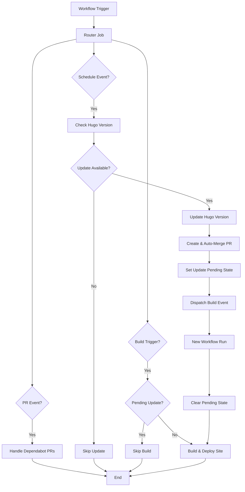

# Hugo Autopilot

[](https://www.repostatus.org/#active)
[](https://github.com/chriopter/hugo-autopilot/blob/main/LICENSE)

A reuseable Workflow to automate the building & updating of a Hugo site with a single workflow file!


> **Note:** Primarly LLM Code - use with caution. Be aware of cascading triggering, potential breaking changes from automatic updates (even major!), resource consumption. Workflows have permissions to modify repository content.


## Features & Workflow Architecture

Hugo Autopilot combines three powerful workflows into a single, easy-to-use solution that you can reference from your Hugo site with just one file. The system uses a smart router mechanism with state management to determine which workflows to run based on the trigger event:



| Event Type | Hugo Builder | Hugo Updater | PR Merger |
|------------|:----------------------------------:|:-----------------------------------:|:------------------------------:|
| | Re-Builds Site Cache-Free | Updates to newest Hugoversion | Accepts all Dependabot PRs |
| On Content Change<br>(`push` to main) | ✅ | ❌ | ❌ |
| On Weekly Check<br>(`schedule` weekly) | ❌ | ✅ | ❌ |
| After Hugo Update<br>(`repository_dispatch`)<br>(`hugo-autopilot-build`) | ✅ | ❌ | ❌ |
| On Dependency Update<br>(`pull_request`) | ❌ | ❌ | ✅ |
| On Manual Trigger<br>(`workflow_dispatch`) | ✅ | ✅ | ✅ |

Note: Dependency Updates are also used by this repo to always use newest sub-workflows like peaceiris/actions-hugo.

### State Management System

Hugo Autopilot includes a state management system that prevents race conditions between Hugo updates and site builds:

1. **Problem**: Without state management, the workflow might build with an old Hugo version while simultaneously updating to a new version.

2. **Solution**: The workflow now tracks update state in a file (`.hugo_update_state` by default):
   - When a Hugo update PR is created, the system sets an "update pending" state
   - Build jobs check this state and skip building if an update is pending
   - After the PR is merged and the repository dispatch triggers a new workflow run, the state is cleared
   - This ensures the site is only built with the latest Hugo version

3. **Benefits**:
   - Prevents building with outdated Hugo versions
   - Eliminates race conditions between updates and builds
   - Provides self-healing through automatic state cleanup
   - Maintains a clear audit trail of update activities

Here's a real-world example from [christopher-eller.de](https://github.com/chriopter/christopher-eller.de):

## Prepare Repo

1. **Create a `.hugoversion` file** in your repository root with your Hugo version (e.g., `0.123.8`)

2. **Copy the dependabot.yml template** to your repository at `.github/dependabot.yml`:

<details>
<summary>Click to expand dependabot.yml template</summary>

```yaml
# Template: dependabot.yml
# Copy this file to your Hugo site repository at .github/dependabot.yml

version: 2
updates:
  # Maintain dependencies for GitHub Actions
  - package-ecosystem: "github-actions"
    directory: "/"
    schedule:
      interval: "weekly"
    # Limit to 5 open pull requests for version updates
    open-pull-requests-limit: 5
    # Add labels to pull requests
    labels:
      - "dependencies"
      - "github-actions"
    # Use custom commit message
    commit-message:
      prefix: "ci"
      include: "scope"
    # Group all updates together
    groups:
      github-actions:
        patterns:
          - "*"

  # Uncomment if using npm in your Hugo site (e.g., for JavaScript processing)
  # - package-ecosystem: "npm"
  #   directory: "/"
  #   schedule:
  #     interval: "monthly"
  #   open-pull-requests-limit: 5
  #   labels:
  #     - "dependencies"
  #     - "npm"
  #   commit-message:
  #     prefix: "build"
  #     include: "scope"
```
</details>

3. **Enable required GitHub settings**: 
   - In repository settings → Actions → General → Workflow permissions:
     - Select "Read and write permissions"
     - Check "Allow GitHub Actions to create and approve pull requests"
   - This ensures the workflow can trigger other workflows after Hugo updates

4. **Create the workflow file** at `.github/workflows/hugo-autopilot.yml` (see below)

## Workflow File

Create this file at `.github/workflows/hugo-autopilot.yml`:

```yaml
name: Hugo Autopilot

on:
  # Triggers the build and deploy job when you push to main branch
  # Ignores changes to import directory to avoid conflicts with photo processing
  push:
    branches: ["main"]
    paths-ignore:
      - 'import/**'
  
  # Triggers the Hugo update job weekly to check for new Hugo versions
  # Runs at 6:00 AM on Mondays to minimize disruption
  schedule:
    - cron: '0 6 * * 1'  # Weekly on Monday
  
  # Triggers the PR auto-merge job when Dependabot creates a PR
  # Automatically handles dependency updates
  pull_request:
  
  # Allows manual triggering of all jobs from the GitHub Actions tab
  # Useful for testing or forcing updates
  workflow_dispatch:
  
  # Allows other workflows to trigger the build job
  # Used by the photo processing workflow to rebuild after adding photos
  repository_dispatch:
    types: [hugo-autopilot-build]

jobs:
  # Single job that routes to the appropriate workflow based on the trigger
  autopilot:
    uses: chriopter/hugo-autopilot/.github/workflows/hugo-autopilot.yml@main
    with:
      # Path to your Hugo version file
      hugo_version_file: '.hugoversion'
      # Enable Git info for Hugo (last modified dates, etc.)
      enable_git_info: true
      # Method to use when merging PRs
      merge_method: 'squash'
      # Path to file for tracking update state (optional)
      update_state_file: '.hugo_update_state'
```

### External Triggers

The hugo-autopilot.yml file you created above is configured to listen for the `repository_dispatch` event with type `hugo-autopilot-build`. You can use this to trigger your Hugo site build from other workflows:

<details>
<summary>Click to expand external trigger example</summary>

```yaml
# Add this to your other workflow files when you need to trigger a site rebuild
- name: Trigger Hugo site rebuild
  uses: peter-evans/repository-dispatch@v3
  with:
    # This targets your own repository
    token: ${{ secrets.GITHUB_TOKEN }}
    # This matches the event type in your hugo-autopilot.yml file
    event-type: hugo-autopilot-build
```
</details>

## Credits

This project builds upon and is inspired by several excellent GitHub Actions:

- [peaceiris/actions-hugo](https://github.com/peaceiris/actions-hugo) - For Hugo setup and deployment patterns
- [peter-evans/create-pull-request](https://github.com/peter-evans/create-pull-request) - For PR creation
- [dependabot/fetch-metadata](https://github.com/dependabot/fetch-metadata) - For Dependabot PR handling

## License

This project is licensed under the MIT License - see the LICENSE file for details.
